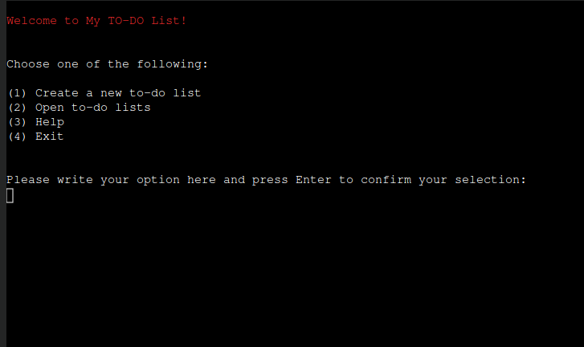

<h1 align="center">My To-do List</h1>

[View the live project here.](https://mytodo-list-a7cb306ab9f5.herokuapp.com/)

## Table of content

1. [About](#about)
2. [User Experience](#user-experience)
2. [Features](#features)
3. [Technologies Used](#technologies-used)
4. [Testing](#testing)
5. [Deployment](#deployment)
6. [Credits](#credits)

## About

My To-Do List is a versatile command-line application designed to efficiently manage your tasks. This tool utilizes Google Sheets to store your to-do lists, offering a seamless and accessible way to keep track of your responsibilities.

## User Experience 
    
- ### User Stories
    1. As a First Time Visitor, I want to easily understand how to run the program.
    2. As a First Time Visitor, I want instructions to quickly learn how to use the application.
    3. As a First Time Visitor, I want to easily navigate in the program.
    4. As a First Time Visitor, I want to be able to create as many lists as I want.
    5. As a First Time Visitor, I want be able to open my lists and see their content. 
    6. As a First Time Visitor, I want to be able to exit the application whenever I choose.

- ### Flow chart

- ### Code
The main() function is usually located at the end of the code bellow the rest of the other functions. For this program it is located at the top of the code for a morefriendly UX. WHen the part of the code containing the vaiables with the credentials and connections with google sheets api, then the loading of the game is very slow. It is good that at least the first intersction of the user with the game is as fast as it can be and then after showing the user some options the loading can be slower. I think in this way is less notisable the slow loading of the program.

- ### Design

- #### Colour Scheme

The color Pure Light Blue was chosen as the backgrund color of the website where the program will run. 

The color white was chosen for the font color of the title and text below the program, as the white makes a good contrast with the background color.

- #### Typography

The font Oswald was chosen for the tile of the website and the font Roboto was chosen for the text below the progem containing the author of the program and the link to the github repocitory.

- #### Wireframes

## Features
### Main Manu

- #### Create a new to-do list:
The application creates a new list. For this the user is prompted to add a name for the new list and then is prompted to add the tasks they want the list to have.
Error messages:
    - If the entered name already exist, a message stating that that there is a list with that name is displayed for the user.
    - If the answer entered by the user is empty, then a message is displayed saying that the name entered must be between 1 and 10 characters long. The reason for this lenght limit is so that the list can be nicely display in a table when the user selects open list in the main menu.

- #### Open todo lists
The user has the option to see all the list they created as a table, to open the content of a list by its name or all the lists with the same date.

- #### See lists

- ##### Open list by name
The application will display the list content with the name provided by the user.

- ##### Open list by date
The application will display all the lists content of the lists containing the provided date.

- #### Help

- #### What to do next menu
Afer each completed action, a what to do message appear with the options from themain menu.

- #### Exit application
The users have the option of exiting the application at any time they are prompt for an answer by entering q, which will re-start the application.

