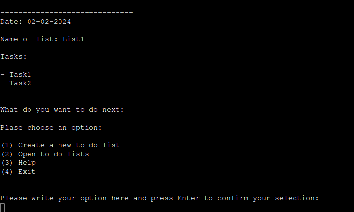
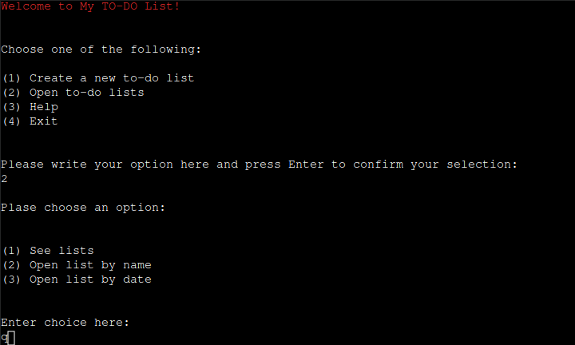
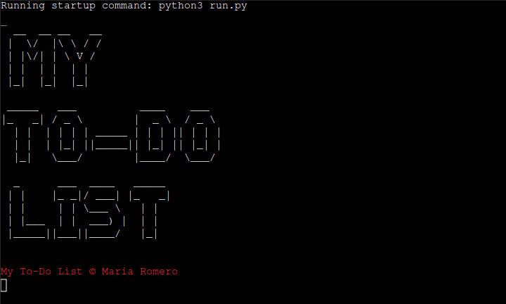
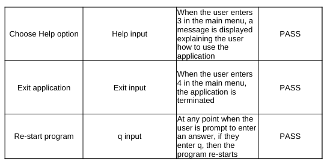
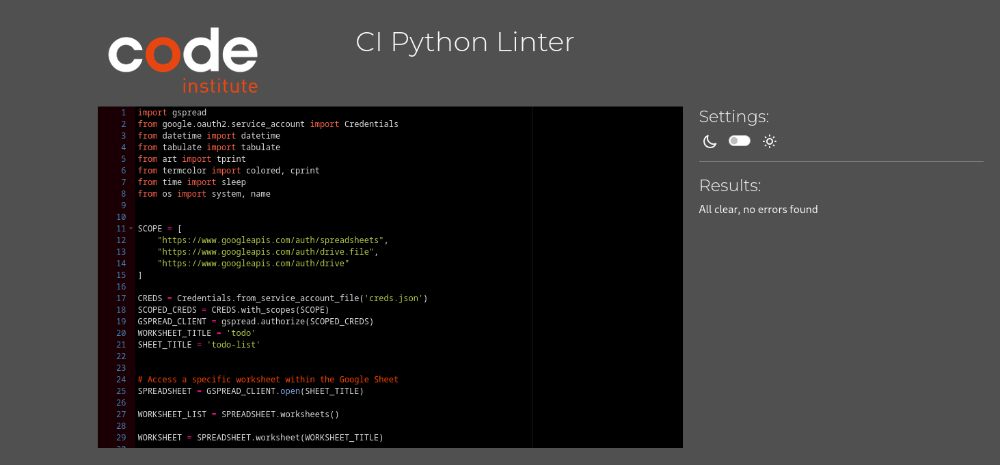

<h1 align="center">My To-do List</h1>

[View the live project here.](https://mytodo-list-a7cb306ab9f5.herokuapp.com/)

## Table of content

1. [About](#about)
2. [User Experience](#user-experience)
2. [Features](#features)
3. [Technologies Used](#technologies-used)
4. [Testing](#testing)
5. [Deployment](#deployment)
6. [Credits](#credits)

## About

My To-Do List is a versatile command-line application designed to efficiently manage your tasks. This tool utilizes Google Sheets to store your to-do lists, offering a seamless and accessible way to keep track of your responsibilities.

## User Experience 
    
- ### User Stories
    1. As a First Time Visitor, I want to easily understand how to run the program.
    2. As a First Time Visitor, I want instructions to quickly learn how to use the application.
    3. As a First Time Visitor, I want to easily navigate in the program.
    4. As a First Time Visitor, I want to be able to create as many lists as I want.
    5. As a First Time Visitor, I want be able to open my lists and see their content. 
    6. As a First Time Visitor, I want to be able to exit the application whenever I choose.

- ### Flow chart

- ### Design

- #### Colour Scheme

The color Pure Light Blue was chosen as the backgrund color of the website where the program will run. 

The color white was chosen for the font color of the title and text below the program, as the white makes a good contrast with the background color.

- #### Typography

The font Oswald was chosen for the tile of the website and the font Roboto was chosen for the text below the progem containing the author of the program and the link to the github repocitory.

- #### Wireframes

## Features
### Main Manu

- #### Create a new to-do list:
The application creates a new list. For this the user is prompted to add a name for the new list and then is prompted to add the tasks they want the list to have.
Error messages:
    - If the entered name already exist, a message stating that that there is a list with that name is displayed for the user.
    - If the answer entered by the user is empty, then a message is displayed saying that the name entered must be between 1 and 10 characters long. The reason for this lenght limit is so that the list can be nicely display in a table when the user selects open list in the main menu.

- #### Open to-do lists
The user has the option to see all the list they created as a table, to open the content of a list by its name or all the lists with the same date.

- #### See lists

- ##### Open list by name
The application will display the list content with the name provided by the user.

- ##### Open list by date
The application will display all the lists content of the lists containing the provided date.

- #### Help

- #### What to do next menu
Afer each completed action, a what to do message appear with the options from themain menu.

- #### Re-start application
The users have the option of exiting the application at any time they are prompt for an answer by entering q, which will re-start the application.

- #### Exit application
When the users choose Exit from the main menu, the program will call the exit() function leading to the termination of the application.

## Upcoming Features
- Option that allows users to import their lists locally to their pcs.

## Technologies used

### Languages Used

- Python

#### External Python Libraries used 

- Gspread for interaction of google sheets with python code.
- Google-auth and google.oauth2 for handling authentication and authorization with Google APIs
- Tabulate for the display of the created lists in a table.
- Art ASCII art library for printing name of app when the user runs the program.
- Termcolor for adding color to welcome message.

### Frameworks and Programs used

- [GitHub:](https://github.com/)
   - GitHub is a version control platform used for collaborative development and code management.

- [Google Fonts:](https://fonts.google.com/)  
   - Google fonts were used to import and apply a variety of fonts to enhance the visual appeal of the website.

- [VSCode (Visual Studio Code):](https://code.visualstudio.com/) 
   - VSCode is a lightweight and powerful code editor used for writing, editing, and debugging the code for this game.

- [Techsini:](https://techsini.com/multi-mockup/)
   - Techsii was used to create mockup images of home page in different devices (phone, ipad, laptop, desktop).

- [Balsamiq:](https://balsamiq.com/)
   - Balsamiq was used to generate wireframes of the game page.

- [Heraku:](https://dashboard.heroku.com/)
   - Heraku was used for the deployment of the application.

- [Lucid Chart:](https://www.lucidchart.com/)
   - Lucid Chart was used for making a flow chart of the application.

- [Google Drive: ](https://drive.google.com/)
   - Google Drive was used for storing the data created with My To-Do List application.

## Testing

### Manual Testing
I performed manual testing continuously at every stage of development.

Manual testing testing tables

### Code Validation
The Code Institute CI Python Linter(https://pep8ci.herokuapp.com/) was used for the validation of the application's code.

## Deployment

### 1. List of Requirements:
- Open your terminal and run the command pip3 freeze > requirements.txt to generate a list of dependencies.
- Commit the changes and push them to your GitHub repository.

### 2. Heroku Account Setup:
- Create an account in Heroku (if you don't have one).
- Navigate to the Heroku dashboard and click on the "Create new app" button.
- Choose a unique name for your app, select the region, and then click "Create app".

### 3. Configuring Environment Variables:
- Open the app settings and click on the "Reveal Config Vars" button.
- Add a key-value pair:
    - Key: PORT
    - Value: 8000
- Click "Add".
- Add another key-value pair:
    - Key: CREDS
    - Value: Paste the entire content of the jason file containing the credentials for the google APIs.
- Click "Add".

### 3. Buildpack Configuration:
- Under the "Settings" tab, locate the "Add buildpack" button.
- Add the Python buildpack and save changes.
- Add the Node.js buildpack below the Python buildpack and save changes.

### 4. Deployment Configuration:
- Go to the "Deploy" tab in settings.
- Choose the deployment method as GitHub.
- Connect your Heroku app to your GitHub repository.
- Search for the GitHub repository name and click "connect".
- You can select the option automatic deploys, which enables any change in the chosen branch to be automatically deployed to the app.
- On manual deploy click "Deploy Branch"
- After a few seconds this message appears: "Your app was successfully deployed."
- Click on "view" to open the website containing the command line application.

## Credits

### Code

- I used the Python Essentials template from Code Institute as the foundation and personalized both the HTML and CSS components.

- The following ideas were taken after seeing [this repocitory:](https://github.com/davidindub/quiz-master)
    - The idea of using ASCII art library for printing name of app when the user runs the program.
    - To write bellow the application console that this application was created by me and a link to the application's github repository.

- The code for the clear function was taken from [here]:(https://www.geeksforgeeks.org/clear-screen-python/)

##  Acknowledgement

I'd like to thank my mentor Brian Macharia, for his invaluable guidance, feedback, tips, and the shared resources. 